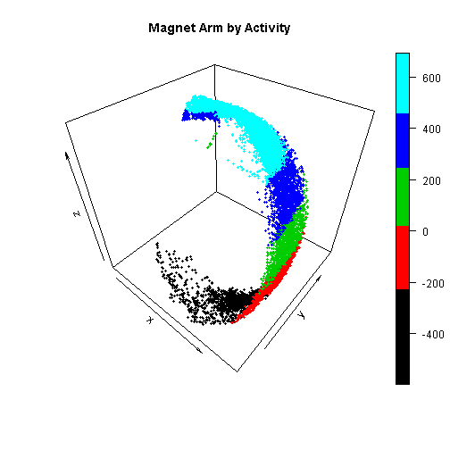
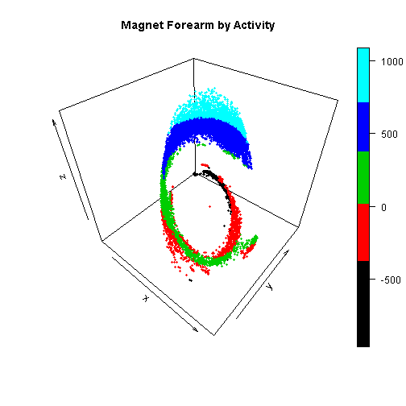
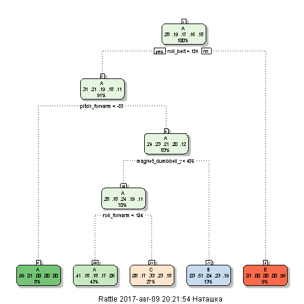
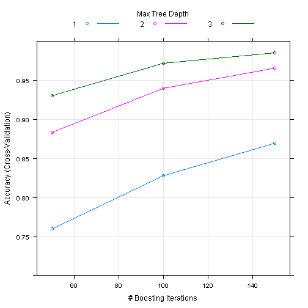
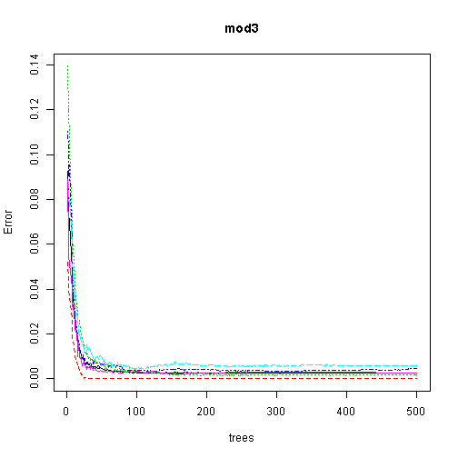

##Introduction
  Using devices such as Jawbone Up, Nike FuelBand, and Fitbit it is now possible to collect a large amount of data about personal activity relatively inexpensively. These type of devices are part of the quantified self movement – a group of enthusiasts who take measurements about themselves regularly to improve their health, to find patterns in their behavior, or because they are tech geeks. One thing that people regularly do is quantify how much of a particular activity they do, but they rarely quantify how well they do it. In this project, your goal will be to use data from accelerometers on the belt, forearm, arm, and dumbell of 6 participants. They were asked to perform barbell lifts correctly and incorrectly in 5 different ways. More information is available from the website here: http://web.archive.org/web/20161224072740/http:/groupware.les.inf.puc-rio.br/har (see the section on the Weight Lifting Exercise Dataset).
  
  The goal of my project is to predict the manner in which people did the exercise in testing data set. I will use as much as possible variables to predict estimate, will fit 3 different models to data and choose what is beter. 

## Loading data,Cleaning & Exploratory analysis


```r
data <- read.csv("pml-training.csv", header=T, na.strings=c("","NA"))
data<-data[,colSums(is.na(data))==0]
dim(data)
```

```
## [1] 19622    60
```


```r
set.seed(1234)
library(caret)
inTrain<-createDataPartition(y=data$classe,p=0.7,list=FALSE)
training<-data[inTrain,]
testing<-data[-inTrain,]
dim(training)
```

```
## [1] 13737    60
```

```r
names(training)
```

```
##  [1] "X"                    "user_name"            "raw_timestamp_part_1"
##  [4] "raw_timestamp_part_2" "cvtd_timestamp"       "new_window"          
##  [7] "num_window"           "roll_belt"            "pitch_belt"          
## [10] "yaw_belt"             "total_accel_belt"     "gyros_belt_x"        
## [13] "gyros_belt_y"         "gyros_belt_z"         "accel_belt_x"        
## [16] "accel_belt_y"         "accel_belt_z"         "magnet_belt_x"       
## [19] "magnet_belt_y"        "magnet_belt_z"        "roll_arm"            
## [22] "pitch_arm"            "yaw_arm"              "total_accel_arm"     
## [25] "gyros_arm_x"          "gyros_arm_y"          "gyros_arm_z"         
## [28] "accel_arm_x"          "accel_arm_y"          "accel_arm_z"         
## [31] "magnet_arm_x"         "magnet_arm_y"         "magnet_arm_z"        
## [34] "roll_dumbbell"        "pitch_dumbbell"       "yaw_dumbbell"        
## [37] "total_accel_dumbbell" "gyros_dumbbell_x"     "gyros_dumbbell_y"    
## [40] "gyros_dumbbell_z"     "accel_dumbbell_x"     "accel_dumbbell_y"    
## [43] "accel_dumbbell_z"     "magnet_dumbbell_x"    "magnet_dumbbell_y"   
## [46] "magnet_dumbbell_z"    "roll_forearm"         "pitch_forearm"       
## [49] "yaw_forearm"          "total_accel_forearm"  "gyros_forearm_x"     
## [52] "gyros_forearm_y"      "gyros_forearm_z"      "accel_forearm_x"     
## [55] "accel_forearm_y"      "accel_forearm_z"      "magnet_forearm_x"    
## [58] "magnet_forearm_y"     "magnet_forearm_z"     "classe"
```


```r
library(plot3D)
suppressWarnings(plot3D::points3D(
+         training$magnet_arm_x, 
+         training$magnet_arm_y, 
+         training$magnet_arm_z, col=training$classe,main="Magnet Arm by Activity",pch=20, cex=0.8))
```



```r
suppressWarnings(plot3D::points3D(
+         training$magnet_forearm_x, 
+         training$magnet_forearm_y, 
+         training$magnet_forearm_z, col=training$classe,main="Magnet Forearm by Activity",pch=20, cex=0.8))
```



We see from this plots, that there is a pattern that depends on activity type.

We will not use first 5 columns as predictors.

```r
training<-training[,6:ncol(training)]
```

##Fitting Prediction models
Firstly lets try the simplest model - Decision Trees.

```r
set.seed(1234)
mod1<-train(classe~.,method="rpart",data=training)
library(rattle)
```

```
## Rattle: A free graphical interface for data mining with R.
## Version 4.1.0 Copyright (c) 2006-2015 Togaware Pty Ltd.
## Type 'rattle()' to shake, rattle, and roll your data.
```

```r
fancyRpartPlot(mod1$finalModel)
```



```r
confusionMatrix(predict(mod1,testing),testing$classe)
```

```
## Confusion Matrix and Statistics
## 
##           Reference
## Prediction    A    B    C    D    E
##          A 1530  486  493  452  168
##          B   35  379   31  164  145
##          C  105  274  502  348  302
##          D    0    0    0    0    0
##          E    4    0    0    0  467
## 
## Overall Statistics
##                                           
##                Accuracy : 0.489           
##                  95% CI : (0.4762, 0.5019)
##     No Information Rate : 0.2845          
##     P-Value [Acc > NIR] : < 2.2e-16       
##                                           
##                   Kappa : 0.3311          
##  Mcnemar's Test P-Value : NA              
## 
## Statistics by Class:
## 
##                      Class: A Class: B Class: C Class: D Class: E
## Sensitivity            0.9140   0.3327   0.4893   0.0000  0.43161
## Specificity            0.6203   0.9210   0.7882   1.0000  0.99917
## Pos Pred Value         0.4890   0.5027   0.3279      NaN  0.99151
## Neg Pred Value         0.9478   0.8519   0.8797   0.8362  0.88641
## Prevalence             0.2845   0.1935   0.1743   0.1638  0.18386
## Detection Rate         0.2600   0.0644   0.0853   0.0000  0.07935
## Detection Prevalence   0.5317   0.1281   0.2602   0.0000  0.08003
## Balanced Accuracy      0.7671   0.6269   0.6388   0.5000  0.71539
```

As we see this model is not good. It's accuracy is 49.57%, it has a lot of errors. So we will not use it further.

The second one will be Boosting:

```r
set.seed(1234)
modControl <- trainControl(method="cv",number=5,verboseIter=FALSE)
mod2<-train(classe~.,method="gbm",data=training,trControl=modControl,verbose=FALSE)
plot(mod2, ylim=c(0.7, 1))
```



```r
pred2<-predict(mod2,testing)
confusionMatrix(pred2,testing$classe)
```

```
## Confusion Matrix and Statistics
## 
##           Reference
## Prediction    A    B    C    D    E
##          A 1673   12    0    0    1
##          B    1 1108    7   10    1
##          C    0   14 1018   14    3
##          D    0    5    1  940   10
##          E    0    0    0    0 1067
## 
## Overall Statistics
##                                           
##                Accuracy : 0.9866          
##                  95% CI : (0.9833, 0.9894)
##     No Information Rate : 0.2845          
##     P-Value [Acc > NIR] : < 2.2e-16       
##                                           
##                   Kappa : 0.983           
##  Mcnemar's Test P-Value : NA              
## 
## Statistics by Class:
## 
##                      Class: A Class: B Class: C Class: D Class: E
## Sensitivity            0.9994   0.9728   0.9922   0.9751   0.9861
## Specificity            0.9969   0.9960   0.9936   0.9967   1.0000
## Pos Pred Value         0.9923   0.9831   0.9704   0.9833   1.0000
## Neg Pred Value         0.9998   0.9935   0.9983   0.9951   0.9969
## Prevalence             0.2845   0.1935   0.1743   0.1638   0.1839
## Detection Rate         0.2843   0.1883   0.1730   0.1597   0.1813
## Detection Prevalence   0.2865   0.1915   0.1782   0.1624   0.1813
## Balanced Accuracy      0.9982   0.9844   0.9929   0.9859   0.9931
```

This method is definitely beter. We have less errors and accuracy is 98.83%. This is a great value.

And the third we will try random Forests^

```r
library(randomForest)
mod3<- randomForest(classe ~ ., data=training)
plot(mod3)
```



```r
pred3<-predict(mod3,testing)
confusionMatrix(pred3,testing$classe)
```

```
## Confusion Matrix and Statistics
## 
##           Reference
## Prediction    A    B    C    D    E
##          A 1674    3    0    0    0
##          B    0 1135    4    0    0
##          C    0    1 1021    4    0
##          D    0    0    1  960    0
##          E    0    0    0    0 1082
## 
## Overall Statistics
##                                           
##                Accuracy : 0.9978          
##                  95% CI : (0.9962, 0.9988)
##     No Information Rate : 0.2845          
##     P-Value [Acc > NIR] : < 2.2e-16       
##                                           
##                   Kappa : 0.9972          
##  Mcnemar's Test P-Value : NA              
## 
## Statistics by Class:
## 
##                      Class: A Class: B Class: C Class: D Class: E
## Sensitivity            1.0000   0.9965   0.9951   0.9959   1.0000
## Specificity            0.9993   0.9992   0.9990   0.9998   1.0000
## Pos Pred Value         0.9982   0.9965   0.9951   0.9990   1.0000
## Neg Pred Value         1.0000   0.9992   0.9990   0.9992   1.0000
## Prevalence             0.2845   0.1935   0.1743   0.1638   0.1839
## Detection Rate         0.2845   0.1929   0.1735   0.1631   0.1839
## Detection Prevalence   0.2850   0.1935   0.1743   0.1633   0.1839
## Balanced Accuracy      0.9996   0.9978   0.9970   0.9978   1.0000
```

This model has beter accuracy - 99.86%. And we will use it to work with our test data set.

## Predicting results on testing data set

```r
datatest <- read.csv("pml-testing.csv", header=T, na.strings=c("","NA"))
datatest<-datatest[,colSums(is.na(data))==0]
final<- predict(mod2, newdata=datatest)
final
```

```
##  [1] B A B A A E D B A A B C B A E E A B B B
## Levels: A B C D E
```

So, now we now in which way people were doing observed exersises.
